<div align="center">

<!-- ═══════════════════════════════════════════════════════════════ -->
<!--                 CUSTOM ANIMATED NAME BANNER                    -->
<!--  Upload name-banner.svg to your repo root for this to work    -->
<!-- ═══════════════════════════════════════════════════════════════ -->



<!-- ═══════════════════════════════════════════════════════════════ -->
<!--                      TYPING ANIMATION                         -->
<!-- ═══════════════════════════════════════════════════════════════ -->


<br/>

<!-- ═══════════════════════════════════════════════════════════════ -->
<!--                    ANIMATED SOCIAL BADGES                     -->
<!-- ═══════════════════════════════════════════════════════════════ -->

<a href="https://www.linkedin.com/in/keshavardhan-m-9b8a22314/">
  
</a>
<a href="https://github.com/keshav-077">
  
</a>
<a href="https://www.kaggle.com/kesavardhanmakireddy">
  
</a>
<a href="https://kesavmakireddi.lovable.app/">
  
</a>
<a href="mailto:keshavardhan777@gmail.com">
  
</a>
<a href="https://discord.com/users/keshav775">
  
</a>
<a href="https://drive.google.com/file/d/1NBP9LMeBJG-CN9U56Hy3QHj5o6vcJTcK/view?usp=sharing">
  
</a>

<br/><br/>

<!-- PROFILE VIEWS — MOST RELIABLE COUNTER -->

&nbsp;


</div>

---

<!-- ═══════════════════════════════════════════════════════════════ -->
<!--                        ABOUT ME                               -->
<!-- ═══════════════════════════════════════════════════════════════ -->

<div align="center">

## ⚡ About Me

</div>

```python
class KesavardhanMakireddi:
    def __init__(self):
        self.name       = "Kesavardhan Makireddi"
        self.role       = "AI Engineer | Researcher | Builder"
        self.education  = [
            "B.Tech CSE (AI/ML) — IIIT Nagpur          [2022 – 2026]",
            "MBA (PGPMCI)        — IIM Visakhapatnam    [2026 – 2028]"
        ]
        self.focus      = [
            "Generative AI & LLMs", "RAG Pipelines",
            "Computer Vision",      "MLOps & AI Automation",
            "LangGraph / Agents",   "Full-Stack AI Apps"
        ]
        self.currently  = "Building production-grade AI systems"
        self.superpower = "Turning research into impactful real-world products"
        self.location   = "Visakhapatnam, India 🇮🇳"
        self.contact    = "keshavardhan777@gmail.com"
        self.open_to    = ["AI/ML Roles", "Research Collab", "Open Source"]

    def __str__(self):
        return "AI Engineer who ships things that work ✅"
```

---

<!-- ═══════════════════════════════════════════════════════════════ -->
<!--                     CONNECT WITH ME                           -->
<!-- ═══════════════════════════════════════════════════════════════ -->

<div align="center">

## 🌐 Connect With Me

<br/>

<a href="https://www.linkedin.com/in/keshavardhan-m-9b8a22314/" target="_blank">
  
</a>&nbsp;&nbsp;
<a href="https://github.com/keshav-077" target="_blank">
  
</a>&nbsp;&nbsp;
<a href="mailto:keshavardhan777@gmail.com" target="_blank">
  
</a>&nbsp;&nbsp;
<a href="https://kesavmakireddi.lovable.app/" target="_blank">
  
</a>&nbsp;&nbsp;
<a href="https://www.kaggle.com/kesavardhanmakireddy" target="_blank">
  
</a>&nbsp;&nbsp;
<a href="https://discord.com/users/keshav775" target="_blank">
  
</a>

<br/><br/>

| 💼 **LinkedIn** | 🐙 **GitHub** | 🌐 **Portfolio** | 📧 **Email** | 📊 **Kaggle** | 💬 **Discord** |
|:---:|:---:|:---:|:---:|:---:|:---:|
| [keshavardhan-m](https://www.linkedin.com/in/keshavardhan-m-9b8a22314/) | [keshav-077](https://github.com/keshav-077) | [lovable.app](https://kesavmakireddi.lovable.app/) | [Gmail](mailto:keshavardhan777@gmail.com) | [kesavardhan](https://www.kaggle.com/kesavardhanmakireddy) | keshav775 |

</div>

---

<!-- ═══════════════════════════════════════════════════════════════ -->
<!--                        EXPERIENCE                             -->
<!-- ═══════════════════════════════════════════════════════════════ -->

<div align="center">

## 🏢 Experience

</div>

<table align="center" width="100%">
<tr>
<td align="center" width="33%">

### 🤖 C5i
**Artificial Intelligence Intern**
`Oct 2025 – Apr 2026` · Mumbai


</td>
<td align="center" width="33%">

### 🧠 Infoteck Solutions
**Machine Learning Intern**
`Oct 2024 – Mar 2025` · Remote, UK


</td>
<td align="center" width="33%">

### 🔬 IIIT Nagpur
**ML Research Intern**
`May 2024 – Jul 2024` · Remote


</td>
</tr>
</table>

---

<!-- ═══════════════════════════════════════════════════════════════ -->
<!--                     IEEE PUBLICATION                          -->
<!-- ═══════════════════════════════════════════════════════════════ -->

<div align="center">

## 📚 IEEE Publication

</div>

<div align="center">

> ### 📄 Deep Learning for Skin Disease Classification Using Smartphone Images and Clinical Metadata
> **IEEE Xplore** · Peer-Reviewed Research
>
> Proposed a multimodal **Vision Transformer (ViT-B/16)** fused with clinical metadata via **8-head Multi-Head Self-Attention (MHSA)** for skin cancer (ACK/BCC) classification on PAD-UFES-20. Outperforms CNN, DenseNet, and lightweight transformer baselines on smartphone images.
>
> 
> 
> 

</div>

---

<!-- ═══════════════════════════════════════════════════════════════ -->
<!--                        EDUCATION                              -->
<!-- ═══════════════════════════════════════════════════════════════ -->

<div align="center">

## 🎓 Education

</div>

<div align="center">

| 🏛️ Institution | 📋 Degree | 📅 Year |
|:---|:---|:---:|
| **IIM Visakhapatnam** | MBA – PGPMCI | 2026 – 2028 |
| **IIIT Nagpur** | B.Tech — CSE (AI & ML) | 2022 – 2026 |

</div>

---

<!-- ═══════════════════════════════════════════════════════════════ -->
<!--                    COMPLETE TECH STACK                        -->
<!-- ═══════════════════════════════════════════════════════════════ -->

<div align="center">

## 🛠️ Complete Tech Stack

</div>

<div align="center">

### 🐍 Languages


</div>

<div align="center">

### 🤖 AI / ML / Deep Learning


</div>

<div align="center">

### 🧠 LLMs / GenAI / Agents


</div>

<div align="center">

### 👁️ Computer Vision


</div>

<div align="center">

### 💬 NLP


</div>

<div align="center">

### 📊 Data Science & Analytics


</div>

<div align="center">

### 🌐 Web & API Development


</div>

<div align="center">

### ☁️ Cloud & Databases


</div>

<div align="center">

### ⚙️ DevOps, MLOps & Tools


</div>

<div align="center">

### 🤖 AI Automation & Agentic IDEs


</div>

<div align="center">

### ⚡ HPC & Parallel Computing


</div>

---

<!-- ═══════════════════════════════════════════════════════════════ -->
<!--                       GITHUB STATS                            -->
<!-- ═══════════════════════════════════════════════════════════════ -->

<div align="center">


<!-- ═══════════════════════════════════════════════════════════════ -->
<!--                   TROPHIES & ACHIEVEMENTS                     -->
<!-- ═══════════════════════════════════════════════════════════════ -->

<div align="center">

## 🏆 Trophies & Achievements


<br/>



</div>

---

<!-- ═══════════════════════════════════════════════════════════════ -->
<!--                      CERTIFICATIONS                           -->
<!-- ═══════════════════════════════════════════════════════════════ -->

<div align="center">

## 📜 Certifications


</div>

---

<!-- ═══════════════════════════════════════════════════════════════ -->
<!--                    CONTRIBUTION GRAPH                         -->
<!-- ═══════════════════════════════════════════════════════════════ -->

<div align="center">

## 📈 Contribution Graph

</div>


---

<!-- ═══════════════════════════════════════════════════════════════ -->
<!--                    CONTRIBUTION SNAKE                         -->
<!-- ═══════════════════════════════════════════════════════════════ -->

<div align="center">

## 🐍 Contribution Snake

<picture>
  <source media="(prefers-color-scheme: dark)" srcset="https://github.com/keshav-077/keshav-077/blob/output/github-snake-dark.svg"/>
  <source media="(prefers-color-scheme: light)" srcset="https://github.com/keshav-077/keshav-077/blob/output/github-snake.svg"/>
  
</picture>

</div>

---

<!-- ═══════════════════════════════════════════════════════════════ -->
<!--                   ANIMATED METRICS CARD                       -->
<!-- ═══════════════════════════════════════════════════════════════ -->

<div align="center">

## 🎯 Profile Summary


&nbsp;


</div>

---

<!-- ═══════════════════════════════════════════════════════════════ -->
<!--                    RANDOM DEV QUOTE                           -->
<!-- ═══════════════════════════════════════════════════════════════ -->

<div align="center">

## 💭 Dev Quote of the Day


</div>

---

<!-- FOOTER WAVE -->


<div align="center">

*"The best way to predict the future is to build it."*

<br/>

[](https://www.linkedin.com/in/keshavardhan-m-9b8a22314/)
[](https://kesavmakireddi.lovable.app/)
[](https://github.com/keshav-077)
[](mailto:keshavardhan777@gmail.com)

</div>
